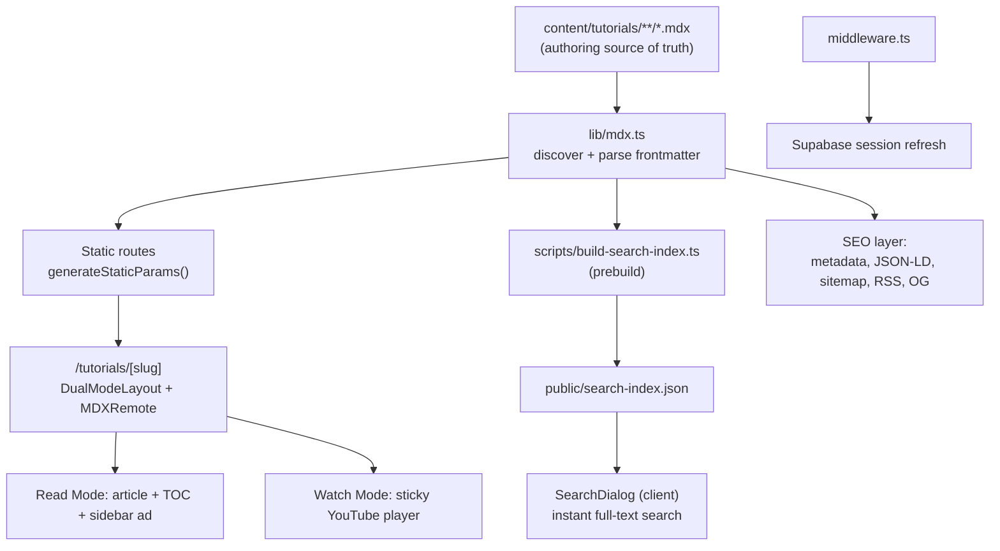

# All About CS (AACS) — Phase 1 Documentation

> **Product:** All About CS — a free developer learning platform with dual-mode (Read / Watch) tutorials.
> **Document type:** Functional & Technical specification for Phase 1 delivery.
> **Status:** Phase 1 — delivered to date.
> **Audience:** Product stakeholders, business analysts, engineers, and contributors.

---

## 1. Executive Summary

**All About CS** is a content-driven, SEO-first web application that teaches computer science through tutorials that can be **read as an article** or **watched as a video** — switchable at any time, mid-scroll, without losing your place. The platform is intentionally **free and frictionless**: no account or signup is required to consume any content.

Phase 1 establishes the **public-facing learning experience and content engine**:

- A polished, responsive marketing/landing experience.
- A file-based (MDX) tutorial authoring and rendering pipeline.
- The signature **Dual-Mode** reading/watching experience.
- Category/topic browsing and full-text client-side search.
- A comprehensive **SEO, structured-data, and discoverability** layer.
- A pluggable, privacy-respecting **advertising** framework (kill-switchable).
- **Foundational scaffolding** for future monetization (Stripe) and accounts (Supabase auth), wired but not yet surfaced as end-user features.

---

## 2. Business Context & Goals

| Goal | How Phase 1 addresses it |
| --- | --- |
| **Reach & discoverability** | Deep SEO: dynamic metadata, JSON-LD structured data (Article, Video, FAQ, Breadcrumb, ItemList, Organization, WebSite), sitemap, robots, RSS feed, and Open Graph images. |
| **Low-friction learning** | No login wall. Static-generated pages load fast; content is free and instantly accessible. |
| **Differentiated UX** | Dual-Mode toggle — the same lesson as a clean article or a pinned, sticky video player. |
| **Authoring velocity** | Authors write Markdown/MDX files; the build pipeline handles routing, indexing, and SEO automatically. |
| **Revenue readiness** | Provider-agnostic ad slots (House / Ethical / AdSense) with a global on/off switch; Stripe and Supabase clients pre-wired for a future "Pro" tier. |

---

## 3. Functional Overview (What the product does)

### 3.1 Personas

- **The Learner** — wants to quickly read or watch a CS topic without signing up.
- **The Author / Maintainer** — adds tutorials as MDX files; expects automatic routing, search, and SEO.
- **The Business Owner** — wants traffic (SEO), optional ad revenue, and a path to paid plans.

### 3.2 Core User Journeys

1. **Discover** — Land on the home page, see the value proposition, latest tutorials, and topics.
2. **Browse** — Explore by **Topic** (Python, DSA) or the full **Tutorials** list.
3. **Search** — Open the command-palette-style search (keyboard-accessible) and jump to any tutorial by title, tag, heading, or body text.
4. **Learn** — Open a tutorial and choose **Read Mode** (article + table of contents + sidebar) or **Watch Mode** (sticky video alongside the article).
5. **Navigate a series** — Multi-part tutorials show a progress indicator with previous/next links.
6. **Return to top / share** — Scroll-to-top control; rich link previews via Open Graph and structured data.

### 3.3 Feature Catalog

#### A. Landing / Home Experience
- Hero section with an animated **WebGL particle field** background, gradient typography, and a "free — no signup" badge.
- Feature highlights (Dual-Mode learning, interactive coding, community).
- Latest tutorials preview and topic entry points.
- Embedded FAQ, breadcrumb, and item-list structured data for SEO.

#### B. Dual-Mode Tutorial Reader (signature feature)
- **Read Mode:** distraction-free article layout (prose typography), a table of contents, a sidebar ad slot, and an inline "video card" that invites switching to Watch Mode.
- **Watch Mode:** a **sticky** (desktop) / stacked (mobile) privacy-friendly YouTube player (`youtube-nocookie`) shown beside the article; inline video references collapse into a "now playing in side panel" badge.
- A single **toggle** flips between modes; state is shared across the page via React context.

#### C. Content Browsing
- **Topics** index and per-topic pages (Python, Data Structures & Algorithms) with descriptions, icons, and gradients.
- **Tutorials** index listing all published tutorials, newest first.
- **Series navigation** for multi-part lessons with a visual progress bar and prev/next links.

#### D. Search
- Client-side, **instant full-text search** over a pre-built JSON index.
- Matches across title, description, tags, headings, and body; highlights matches and shows contextual snippets.
- Keyboard-first command-palette UX rendered through a React portal.

#### E. Advertising Framework (revenue-ready, off by default)
- A single `AdPlacement` component is the only ad entry point the app uses.
- **Global kill switch** via environment variable; renders nothing when disabled.
- **Provider-agnostic**: House ads, Ethical Ads, or Google AdSense selected by config.
- **Layout-stability protection (CLS)**: reserves fixed slot heights with a skeleton while the provider lazy-loads.

#### F. Discoverability & SEO
- Per-page dynamic metadata (title, description, keywords, canonical URLs).
- **JSON-LD structured data**: WebSite, Organization, TechArticle, VideoObject, FAQPage, BreadcrumbList, ItemList.
- **Open Graph / Twitter cards**, dynamic OG image route, **sitemap.xml**, **robots.txt**, **RSS feed**, and a PWA **web manifest**.

#### G. Theming & Accessibility
- Light/dark theme with a toggle (system-aware via `next-themes`).
- Responsive layouts, mobile navigation drawer, semantic landmarks (e.g., `aside` labelled "Sponsored"), and keyboard support in search.

#### H. Foundational (wired, not yet user-facing)
- **Supabase** SSR auth scaffolding (browser, server, and middleware clients) with session refresh in Next.js middleware.
- **Stripe** server client prepared for a future paid "Pro" tier (a "Go Pro" button is present in the UI as a placeholder).

---

## 4. Technical Overview (How it is built)

### 4.1 Technology Stack

| Layer | Technology |
| --- | --- |
| Framework | **Next.js 16** (App Router, React Server Components) |
| UI runtime | **React 19** |
| Language | **TypeScript 5.9** |
| Styling | **Tailwind CSS 4** + `@tailwindcss/typography` |
| Content | **MDX** via `next-mdx-remote` (RSC) + `gray-matter` frontmatter + `remark-gfm` |
| Icons | `lucide-react` |
| Theming | `next-themes` |
| Auth (scaffolding) | **Supabase** (`@supabase/ssr`, `@supabase/supabase-js`) |
| Payments (scaffolding) | **Stripe** |
| Tooling | ESLint 9 (`eslint-config-next`), `tsx` for build scripts |
| Graphics | Raw **WebGL** particle field (no heavy 3D dependency) |

### 4.2 Architecture at a Glance



**Key principle:** content is the source of truth. Adding an `.mdx` file under `content/tutorials/<category>/` automatically creates a route, registers it for search indexing, and feeds the SEO/structured-data layer — no code changes required.

### 4.3 Project Structure (relevant parts)

| Path | Responsibility |
| --- | --- |
| `content/tutorials/<category>/*.mdx` | Tutorial content + frontmatter (title, description, date, youtubeId, tags, published). |
| `src/app/` | App Router pages: home, about, topics, tutorials, and SEO routes (`sitemap.ts`, `robots.ts`, `manifest.ts`, `feed.xml`, `api/og`). |
| `src/app/tutorials/[slug]/page.tsx` | Tutorial page: static params, dynamic SEO metadata, MDX rendering inside the dual-mode layout. |
| `src/lib/mdx.ts` | Tutorial discovery, frontmatter parsing, publish filtering, sorting, category derivation. |
| `src/lib/search-index.ts` | Builds the search index (markdown/JSX stripping, heading extraction). |
| `src/lib/categories.ts` | Topic/category metadata (label, descriptions, icon, color, gradient). |
| `src/lib/json-ld.ts` | Structured-data generators. |
| `src/lib/supabase/` | SSR auth clients (`client.ts`, `server.ts`, `middleware.ts`). |
| `src/lib/stripe.ts` | Server-side Stripe client (future Pro tier). |
| `src/components/` | UI: dual-mode provider/toggle/layout, YouTube embed, search, navbar/footer, TOC, series nav, particle field, theme, ads. |
| `scripts/build-search-index.ts` | Prebuild step writing `public/search-index.json`. |

### 4.4 Content & Rendering Pipeline

1. **Discovery** — `discoverTutorialFiles()` recursively scans `content/tutorials`, deriving the `slug` from the filename and the `category` from the parent folder. Results are cached per process.
2. **Parsing** — `gray-matter` separates frontmatter from MDX body. The `TutorialFrontmatter` interface defines the contract (`title`, `description`, `date`, `youtubeId`, optional `tags`, `author`, `published`).
3. **Publish gating** — In production, tutorials with `published: false` are excluded from listings and the search index.
4. **Static generation** — `generateStaticParams()` pre-renders every tutorial route at build time for fast, cacheable pages.
5. **Rendering** — `MDXRemote` (RSC) renders the body with `remark-gfm`, injecting custom components: `YouTubeEmbed`, `Callout`, `TableOfContents`, `SeriesNavigation`.

### 4.5 Dual-Mode Implementation

- `DualModeProvider` exposes `{ mode, toggle, setMode }` via React context (`"read" | "watch"`).
- `DualModeLayout` chooses the layout: Read Mode renders a prose article with a sidebar; Watch Mode renders a two-column grid with a sticky video.
- `YouTubeEmbed` is **context-aware** — it renders three distinct presentations (read-mode invitation card, watch-mode inline "now playing" badge, and the layout-level sticky player) from a single component.
- Privacy: videos use `youtube-nocookie.com` with `rel=0`.

### 4.6 Search Implementation

- **Build time:** `scripts/build-search-index.ts` (run via the `prebuild` npm script) calls `generateSearchIndex()` to strip markdown/JSX to plain text, extract headings, and emit `public/search-index.json`.
- **Run time:** `SearchDialog` (client component) fetches the static index and performs in-memory substring matching across title/description/tags/headings/body, with match highlighting and snippet extraction — no server round-trips and no external search service.

### 4.7 SEO & Structured Data

- **Metadata:** a global template in `layout.tsx` plus per-tutorial `generateMetadata()` (canonical URLs, Open Graph article data, Twitter cards, keywords from tags).
- **JSON-LD:** generators in `lib/json-ld.ts` produce `WebSite`, `Organization`, `TechArticle`, `VideoObject`, `FAQPage`, `BreadcrumbList`, and `ItemList` graphs injected via the `JsonLd` component.
- **Crawl & syndication:** `sitemap.ts`, `robots.ts`, `feed.xml/route.ts` (RSS), `manifest.ts` (PWA), and `api/og` (dynamic OG images).

### 4.8 Advertising Architecture

- `AdPlacement` is the sole public surface; it reads `NEXT_PUBLIC_ENABLE_ADS` (kill switch) and `NEXT_PUBLIC_AD_PROVIDER` (provider selection).
- Provider components (`HouseAd`, `EthicalAd`, `AdSenseAd`) are **lazy-loaded** behind `Suspense`, with fixed min-heights and a skeleton to prevent layout shift (CLS).

### 4.9 Auth & Payments Scaffolding

- **Supabase:** `client.ts` (browser), `server.ts` (RSC/route handlers/actions via cookies), and `middleware.ts` (session refresh). `src/middleware.ts` wires `updateSession` for all non-static routes.
- **Stripe:** a typed server client is initialized from `STRIPE_SECRET_KEY` for future checkout/subscription flows.
- These are intentionally **not yet surfaced** as user features in Phase 1.

### 4.10 Configuration (Environment Variables)

| Variable | Purpose |
| --- | --- |
| `NEXT_PUBLIC_SITE_URL` | Canonical base URL for metadata, sitemap, RSS, OG. |
| `NEXT_PUBLIC_ENABLE_ADS` | Global ad kill switch (`"true"` to enable). |
| `NEXT_PUBLIC_AD_PROVIDER` | `house` \| `ethical` \| `adsense`. |
| `NEXT_PUBLIC_SUPABASE_URL` / `NEXT_PUBLIC_SUPABASE_ANON_KEY` | Supabase auth (scaffolding). |
| `STRIPE_SECRET_KEY` | Stripe server client (scaffolding). |
| `NEXT_PUBLIC_GOOGLE_SITE_VERIFICATION` / `NEXT_PUBLIC_BING_SITE_VERIFICATION` | Search-engine verification. |

---

## 5. Non-Functional Characteristics

- **Performance:** static generation, cached content discovery, lazy-loaded ads, and a lightweight raw-WebGL animation (no heavy 3D library).
- **Privacy:** cookie-less YouTube embeds; no signup required; ads disabled by default.
- **Accessibility:** semantic landmarks, labelled regions, keyboard-accessible search, and theme support.
- **Layout stability:** reserved ad heights with skeletons to minimize Cumulative Layout Shift.
- **Maintainability:** content/code separation, a single ad entry point, typed frontmatter contract, and centralized SEO generators.
- **Security posture:** secrets confined to server-only clients; public env vars limited to non-sensitive config; middleware scoped to exclude static assets.

---

## 6. Authoring a New Tutorial (Operational Guide)

1. Create `content/tutorials/<category>/<slug>.mdx`.
2. Add frontmatter:
   ```yaml
   ---
   title: "Your Tutorial Title"
   description: "One-line summary for SEO and cards."
   date: "2026-06-22"
   youtubeId: "abc123XYZ"
   tags: ["python", "beginners"]
   author: "Sandipan Das"
   published: true
   ---
   ```
3. Write the body in Markdown/MDX; optionally use `<Callout>`, `<TableOfContents />`, `<SeriesNavigation ... />`, `<YouTubeEmbed id="..." />`.
4. Build — the route, search index entry, sitemap, RSS, and structured data are generated automatically.

---

## 7. Phase 1 Scope Summary

**Delivered**
- Dual-mode tutorial experience (Read / Watch).
- MDX content pipeline with frontmatter, publish gating, and static generation.
- Topic and tutorial browsing + series navigation.
- Client-side full-text search with a prebuilt index.
- Comprehensive SEO/structured-data/discoverability layer.
- Pluggable, kill-switchable advertising framework.
- Theming, responsive design, and accessibility foundations.
- Supabase auth + Stripe scaffolding (wired, not surfaced).

**Intentionally deferred (future phases)**
- User accounts, profiles, and progress tracking (Supabase activation).
- Paid "Pro" tier and checkout (Stripe activation).
- Interactive in-browser code execution.
- Community features (comments, discussions).

---

## 8. Glossary

- **Dual-Mode** — the Read/Watch toggle that presents the same lesson as an article or a video.
- **MDX** — Markdown extended with JSX components, used for tutorial content.
- **Frontmatter** — YAML metadata block at the top of each MDX file.
- **JSON-LD** — structured data format that helps search engines and LLMs understand page content.
- **CLS** — Cumulative Layout Shift, a Core Web Vitals metric the ad framework guards against.
- **RSC** — React Server Components, used for server-rendered pages and MDX rendering.
