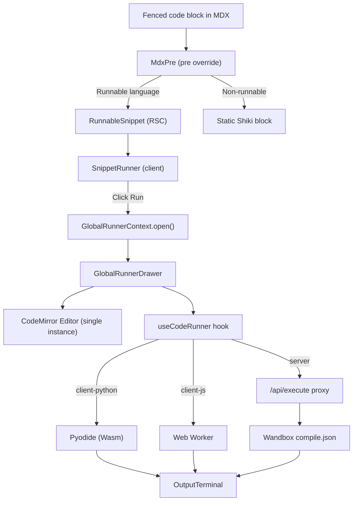

# All About CS (AACS) — Phase 2 Documentation

> **Product:** All About CS — a free developer learning platform with dual-mode tutorials.
> **Document type:** Functional & Technical specification for Phase 2 delivery.
> **Status:** Phase 2 — delivered.
> **Audience:** Product stakeholders, business analysts, engineers, and contributors.

---

## 1. Executive Summary

Phase 2 delivers the **Interactive Code Execution Engine** — the feature that Phase 1 explicitly deferred as "Interactive in-browser code execution." Learners can now **run code directly from any tutorial** without leaving the page, or use a standalone multi-language **Playground IDE** at `/playground`.

Key achievements:

- A **Hybrid Execution Architecture** — Python & JavaScript run 100% in the browser (zero server cost, works offline); compiled languages (C++, Java, Go, Rust, PHP, TypeScript, SQL) execute via a free, key-less remote backend (Wandbox).
- A **singleton Global Runner Drawer** — one shared CodeMirror editor slides out on demand, keeping tutorial pages lightweight regardless of how many code blocks exist.
- **Every fenced code block in MDX auto-upgrades** to a runnable snippet with a "Run" button — no manual tagging required by authors.
- A full **standalone Playground page** (`/playground`) with language selector, custom input (stdin), and an output terminal.
- **Batch input support** for all languages — `input()` (Python), `prompt()`/`readline()` (JS), and `stdin` (compiled) all work via a unified input box.

---

## 2. Business Context & Goals

| Goal | How Phase 2 addresses it |
| --- | --- |
| **Active learning** | Readers execute code in-context without switching tools, increasing engagement and retention. |
| **Zero-friction execution** | No accounts, no API keys, no installation — Python/JS run locally; compiled languages hit a free public service (Wandbox). |
| **Page performance** | Only ONE editor ever mounts per page (the drawer); all other blocks are static Shiki HTML. No per-snippet JS hydration cost. |
| **Author simplicity** | Standard fenced code blocks (` ```python `) are automatically runnable — no custom JSX wrappers needed. |
| **Backend flexibility** | The `/api/execute` proxy is the single swap point; changing Wandbox → Piston or any other backend rewrites one file. |

---

## 3. Functional Overview

### 3.1 User Journeys (Phase 2 additions)

1. **Run a tutorial snippet** — See a code block → click "Run" → the Global Runner Drawer slides out with the code auto-pasted → code executes → output appears instantly.
2. **Edit & re-run** — Modify the code inside the drawer's CodeMirror editor → hit "Run" again.
3. **Provide input** — Click "Add input" → type values (one per line) → run. Works for `input()` (Python), `prompt()` (JS), `scanf`/`cin` (C/C++), etc.
4. **Use the standalone Playground** — Navigate to `/playground` → select any language → write code → run. Full IDE experience with input panel and output terminal.
5. **Switch snippets quickly** — Click "Run" on a different code block → the drawer replaces previous code, clears output, and auto-runs the new snippet.

### 3.2 Feature Catalog (Phase 2)

#### A. Global Runner Drawer (in-tutorial execution)
- **Singleton architecture**: one CodeMirror 6 editor + one runtime instance shared across the entire page.
- **Slide-out panel**: right side-panel on desktop (480px), bottom sheet (82vh) on mobile.
- **Auto-paste & auto-run**: clicking "Run" on any snippet dispatches its code into the drawer, replacing any previous content, and immediately executes.
- **Reset**: restores original snippet code and clears output.
- **Keyboard accessible**: Escape to close; body scroll-lock while open.
- **Lazy mounted**: the heavy editor only loads on first "Run" click (never on initial page load).

#### B. Standalone Playground (`/playground`)
- Multi-language selector (10 languages).
- Dedicated CodeMirror editor with per-language grammar highlighting.
- Input (stdin) panel available for all languages.
- Output terminal with success/error coloring and duration display.
- SEO metadata for discoverability.

#### C. Hybrid Execution Engine
- **Client-side (browser):**
  - Python → Pyodide 0.27.2 (WebAssembly), CDN-loaded, booted once per tab.
  - JavaScript → sandboxed Web Worker with console shim + 5s timeout.
- **Server-side (proxy):**
  - All other languages → `/api/execute` → Wandbox compile & run.
  - Dynamic compiler resolution (newest-first from `/list.json`, cached 30min).
  - Rate limiting (20 req/IP/min), code length cap (20k chars), stdin cap (4k chars).

#### D. Automatic Runnable Code Blocks (MDX `pre` override)
- Every fenced code block with a recognized language (python, javascript, typescript, cpp, c, java, go, rust, php, sql + aliases) gets a "Run" button automatically.
- Non-runnable fences (bash, json, text, yaml, etc.) render as static highlighted blocks without a button.
- No MDX changes required — existing tutorials gained Run buttons without any edits.

#### E. Batch Input Support
- Python: `input()` reads lines from the input box; EOF raises `EOFError`.
- JavaScript: `prompt(msg)` and `readline()` pull lines from input.
- Server languages: stdin is passed directly to the program.
- Unified UX: "Add input" button, textarea, one value per line.

---

## 4. Technical Overview

### 4.1 Technology Additions (Phase 2)

| Layer | Technology |
| --- | --- |
| Code editor | **CodeMirror 6** (`@codemirror/state`, `view`, `commands`, `theme-one-dark`, 9 language grammars) |
| Static highlighting | **Shiki** (dual-theme, CSS-variable approach — `github-light` / `github-dark`) |
| Python runtime | **Pyodide 0.27.2** (Wasm, jsDelivr CDN) |
| JS sandbox | Disposable **Web Worker** with console shim |
| Server execution | **Wandbox** (https://wandbox.org) — free, key-less, public API |
| State management | React Context (`GlobalRunnerContext`) with monotonic token dispatch |

### 4.2 Architecture



### 4.3 Component & File Map

| Path | Responsibility |
| --- | --- |
| `src/components/playground/global-runner-context.tsx` | Singleton state provider: `isOpen`, `code`, `language`, `title`, `token`. `open()` dispatches snippets; `close()` hides drawer. |
| `src/components/playground/global-runner-drawer.tsx` | The slide-out panel: lazy-mounts CodeMirror + runtime on first open; re-seeds code on each new `token`; auto-runs. |
| `src/components/playground/snippet-runner.tsx` | Client trigger: renders static Shiki HTML + "Run" button that calls `open()`. |
| `src/components/playground/runnable-snippet.tsx` | RSC: highlights code with Shiki at build time, passes to `SnippetRunner`. |
| `src/components/playground/mdx-code-block.tsx` | `MdxPre` — the `<pre>` override that auto-upgrades fenced blocks to runnable snippets. |
| `src/components/playground/code-mirror-editor.tsx` | Controlled CodeMirror 6 instance with `Compartment`-based language/theme hot-swap. |
| `src/components/playground/output-terminal.tsx` | Renders `RunResult` (stdout/stderr/duration/status). |
| `src/hooks/use-code-runner.ts` | The "traffic controller" hook: dispatches to Pyodide, Web Worker, or server based on language registry. |
| `src/lib/playground/languages.ts` | Language registry: id, label, target, Shiki grammar, Wandbox label, default code. |
| `src/lib/playground/client-runtimes.ts` | Pyodide boot/run + JS Worker creation/execution + stdin wiring. |
| `src/lib/playground/types.ts` | Shared types: `RunResult`, `RunnerStatus`, `ExecutionTarget`, `PlaygroundLanguage`. |
| `src/app/api/execute/route.ts` | Next.js Route Handler: validates, rate-limits, resolves compiler, POSTs to Wandbox, normalizes response. |
| `src/app/playground/page.tsx` | Standalone playground page (metadata + wrapper). |
| `src/app/playground/playground-client.tsx` | Full playground IDE: language selector, editor, stdin panel, output. |

### 4.4 Execution Backends — Decision History

| Backend | Status | Reason |
| --- | --- | --- |
| **Piston** (self-hosted) | Evaluated → rejected | Public `emkc.org` endpoint became whitelist-only; requires self-hosting Docker infra. |
| **Judge0** (RapidAPI) | Implemented → rejected | Requires RapidAPI registration + paid-per-use — violates zero-friction goal. |
| **Wandbox** | ✅ **Current** | Free, public, key-less, zero config. Trade-off: no SLA, community rate limits. |

The architecture is **backend-agnostic** by design: swapping Wandbox for another service means rewriting only `src/app/api/execute/route.ts`. The frontend, hook, and language registry are unchanged.

### 4.5 Editor Choice — CodeMirror 6 vs Monaco

| Criterion | CodeMirror 6 (chosen) | Monaco |
| --- | --- | --- |
| Bundle size | ~50–100 KB (modular) | 2–5 MB |
| Next.js / RSC compat | ESM-native, `dynamic(ssr:false)` works cleanly | AMD loader fights Turbopack; heavy shimming |
| Mobile/touch | Excellent | Poor |
| Theming | CSS-variable native (Tailwind-friendly) | Own JSON format |
| Language switch | `Compartment` reconfigure (instant, no teardown) | Requires model dispose/create |
| IntelliSense | Not built-in (not needed here) | Best-in-class (overkill for run-only sandbox) |

### 4.6 Security & Guardrails

- **Client-side**: Python runs in Pyodide's Wasm sandbox (no filesystem, no network). JS runs in a disposable Worker (no DOM, no cookies, no localStorage) with a hard 5s timeout.
- **Server-side proxy** (`/api/execute`):
  - In-memory per-IP rate limiter (20 requests / 60s window).
  - Code length cap: 20,000 characters.
  - Stdin length cap: 4,000 characters.
  - No API key exposed to client; `WANDBOX_API_URL` is server-only.
  - Input validated (language must exist in registry with `wandbox` field, code must be non-empty).
  - Errors from Wandbox are surfaced as generic 502 (no backend details leaked).
- **No user data persisted**: code is transient; nothing is stored server-side.

### 4.7 Configuration (Phase 2 additions)

| Variable | Purpose | Required |
| --- | --- | --- |
| `WANDBOX_API_URL` | Override Wandbox endpoint (only if self-hosting) | No (defaults to `https://wandbox.org/api`) |

No API keys, no accounts, no secrets — the execution engine works out of the box with zero configuration.

---

## 5. Non-Functional Characteristics (Phase 2)

- **Performance**: static Shiki HTML for read; one lazy-loaded editor on demand. Pyodide boots once per tab and is reused. Wandbox compilers cached 30 min.
- **Offline resilience**: Python & JS execute entirely in the browser; compiled languages gracefully show "backend unavailable" if offline.
- **Privacy**: all client execution is on-device; server execution sends only the user's code to Wandbox (no tracking, no accounts).
- **Reliability**: Wandbox is a community service (no SLA). Acceptable for a learning platform; the proxy layer makes swapping trivial.
- **Accessibility**: drawer has `role="dialog"`, `aria-modal`, `aria-label`; Escape to close; CodeMirror has `aria-label`.
- **Layout stability**: drawer uses fixed dimensions and transitions; no CLS from editor mount.

---

## 6. Authoring Guide (Phase 2 additions)

### Making code runnable

**Do nothing** — any standard fenced code block with a supported language is automatically runnable:

~~~markdown
```python
print("Hello, world!")
```
~~~

This renders a styled code block with a **Run** button. Clicking it opens the Global Runner Drawer with the code pre-loaded and auto-executed.

### Supported languages (auto-runnable)

`python`, `javascript` (`js`, `node`), `typescript` (`ts`), `cpp` (`c++`, `cc`, `cxx`), `c`, `java`, `go` (`golang`), `rust` (`rs`), `php`, `sql` (`sqlite`, `mysql`, `postgresql`).

### Non-runnable blocks

Fences with other languages (`bash`, `json`, `yaml`, `text`, etc.) render as static highlighted blocks — no Run button.

### Input-dependent examples

If your example requires user input, mention it in the prose:

~~~markdown
This program asks for your name. Click **Run**, then enter a name in the input box:

```python
name = input("What is your name? ")
print(f"Hello, {name}!")
```
~~~

---

## 7. Phase 2 Scope Summary

**Delivered**

- Hybrid execution engine (client-side Pyodide/Worker + server-side Wandbox proxy).
- Global Runner Drawer (singleton, slide-out, auto-paste, auto-run).
- CodeMirror 6 editor with per-language grammar, light/dark theme sync.
- Standalone `/playground` page (10-language IDE).
- Automatic `<pre>` override — every fenced code block becomes runnable without MDX changes.
- Batch input (stdin) support for all three execution targets.
- Rate limiting, length validation, and security hardening on the proxy.
- SEO metadata for the playground page.

**Intentionally deferred (future phases)**

- Interactive (real-time, mid-execution) input prompting (requires streaming/WebSocket approach).
- AI-powered code explanation / visualization (the `_deferred/visualize` route is scaffolded).
- Per-user code persistence / history (requires Supabase auth activation from Phase 1).
- Multi-file / project execution.
- Custom compiler version selection.

---

## 8. Glossary (Phase 2 additions)

- **Hybrid Execution Architecture** — the pattern of routing different languages to different runtimes (browser Wasm, browser Worker, or remote server) from a single hook.
- **Wandbox** — a free, public, key-less compile-and-run web service supporting 30+ languages.
- **Pyodide** — CPython compiled to WebAssembly; runs Python entirely in the browser.
- **CodeMirror 6** — a modular, extensible code editor library for the web.
- **Shiki** — a syntax highlighter that generates static HTML with VS Code-quality highlighting (used for the non-interactive read view).
- **Global Runner Drawer** — the single, shared slide-out panel containing the editor and runtime.
- **Batch stdin** — the model where all input values are provided upfront (one per line) before execution, rather than interactively mid-run.
- **Compartment** — a CodeMirror abstraction that allows hot-swapping extensions (language grammar, theme) without rebuilding the editor state.
